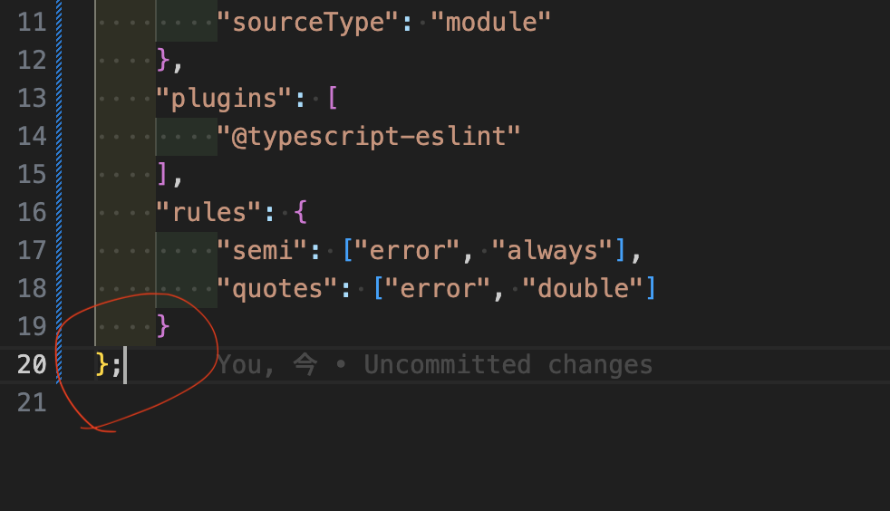

# TypeScriptでESlintを使う

こちらを参照

https://zenn.dev/joo_hashi/articles/bc49be646833dc

package.jsonを作成する
```bash
npm init -y
```

インストールするパッケージ
```bash
npm install eslint --save-dev
```

インストールしたらこのコマンドを実行する
自動でeslintの設定をしてくれるようだ。
```bash
npm init @eslint/config
```

設定の手順をスクリーンショットで記載する


## ルールを追加
; をつけるのを必須にすると設定ファイルにも静的解析がかかるので、
; をつける!


**つけたら消える!**

